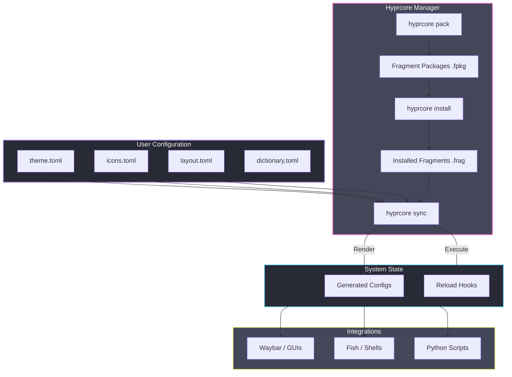

# Hyprcore

**Strict Corporate Design Enforcement for Hyprland.**

> "Single Source of Truth". One config change propagates to Shells, Scripts, Logs, GUIs, and TUI apps instantly.

---

##  Mission

Hyprcore unifies the theming and configuration of your entire **Hyprland** ecosystem. Instead of editing 10 different config files to change a color or font, you edit **one** central configuration. Hyprcore then propagates these changes to all your installed applications ("Fragments") via powerful templates.

##  Installation

### Option A: Using Just (Recommended)
```bash
just install
```

### Option B: Manual
```bash
./install.sh
```

Both methods will:
1.  Create `~/.config/hyprcore/` with default configurations.
2.  Build release binaries (`hyprcore`, `corelog`).
3.  Install them to `~/.local/bin/`.

> [!IMPORTANT]
> Ensure `~/.local/bin` is in your `$PATH`.

---

## Project Structure

```
.
├── crates/              # Rust crates
│   ├── core_lib/        # Shared library (config, factories)
│   ├── corelog/         # Logging CLI
│   └── hyprcore/        # Fragment manager CLI
├── assets/              # Resources
│   ├── fragments/       # Example .frag files
│   └── examples/        # Example configs
├── Cargo.toml           # Workspace config
└── install.sh
```

---

## Workflow



---

## Commands

### Fragment Management
```bash
# Install a single fragment
hyprcore install ./assets/fragments/waybar.frag

# Install a fragment package (.fpkg)
hyprcore install my-theme.fpkg

# Pack fragments into a package
hyprcore pack ./my-fragments -o my-theme.fpkg

# Sync all installed fragments
hyprcore sync

# List installed fragments
hyprcore list
```

### Logging
```bash
# Ad-hoc logging
corelog error SYSTEM "Database connection failed"

# Using a preset
corelog boot_ok
```

---

##  Fragments (`.frag`)

A **Fragment** is a single TOML file that teaches Hyprcore how to theme a specific application.

### Structure
```toml
[meta]
id = "waybar"

[[templates]]
target = "~/.config/waybar/style.css"
content = """
window#waybar {
    background-color: {{ colors.bg }};
    border-bottom: 2px solid {{ colors.primary }};
}
"""

[hooks]
reload = "pkill -SIGUSR2 waybar"
```

### Template Syntax (Tera)
You can access all config values in your templates:
*   `{{ colors.name }}`
*   `{{ fonts.name }}`
*   `{{ icons.name }}`

---

## Fragment Packages (`.fpkg`)

Bundle multiple fragments into a single distributable package:

```bash
# Create package
hyprcore pack ./my-fragments -o my-theme.fpkg

# Install package (extracts all fragments)
hyprcore install my-theme.fpkg
```

`.fpkg` files are standard ZIP archives containing `.frag` files.

---

##  Configuration

Located in `~/.config/hyprcore/`.

| File | Purpose |
|------|---------|
| `theme.toml` | Colors & Fonts |
| `icons.toml` | Icon abstractions (nerdfont/ascii) |
| `layout.toml` | Log structure & formatting |
| `dictionary.toml` | Pre-defined messages |
| `*.toml` | Any file can imply a modular config structure via `include` |

### Modular Configuration
You may split your configuration into multiple files using the `include` key in any of the above configuration files:
```toml
include = ["themes/dracula.toml", "themes/overrides.toml"]
```

---

## Performance

Optimized for speed with LTO and size optimizations:

| Command | Time |
|---------|------|
| `pack` (100 frags) | ~14 ms |
| `install` (100 frags) | ~17 ms |
| `list` | ~4 ms |

Binary sizes:
- `corelog`: ~1 MB
- `hyprcore`: ~6 MB

---

##  Uninstall

```bash
just uninstall
# OR
./uninstall.sh
```
