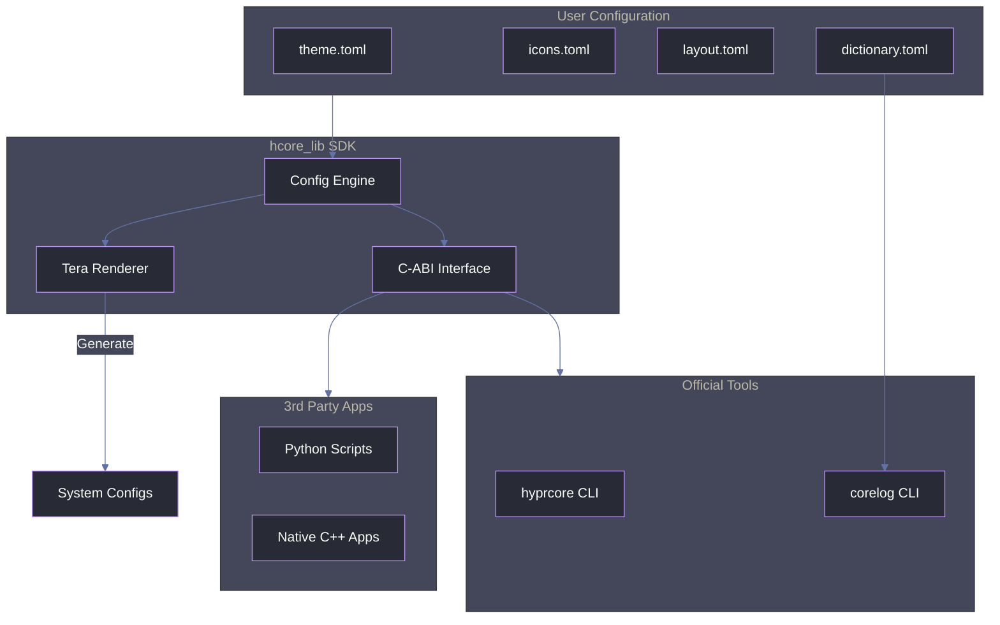

# Hyprcore

**Strict Corporate Design Enforcement for Hyprland.**

> "Single Source of Truth". One config change propagates to Shells, Scripts, Logs, GUIs, and TUI apps instantly.
> Now with C-API support for C++, Python, and more.

    

---

##  Mission

Hyprcore unifies the theming and configuration of your entire **Hyprland** ecosystem. Instead of editing 10 different config files to change a color or font, you edit **one** central configuration. Hyprcore then propagates these changes to all your installed applications ("Fragments") via powerful templates.

With the new **C-ABI Compatible Core**, Hyprcore is no longer just a CLI tool—it's a system-wide SDK that can be embedded into any application.

##  Installation

### Option A: Using Just (Recommended)
```bash
just install
```

### Option B: Manual
```bash
./install.sh
```

Both methods will:
1.  Create `~/.config/hyprcore/` with default configurations.
2.  Build release binaries (`hyprcore`, `corelog`) and shared libraries (`libhcore_lib.so`).
3.  Install them to `~/.local/bin/` and `~/.local/lib/`.

> [!IMPORTANT]
> Ensure `~/.local/bin` is in your `$PATH` and `LD_LIBRARY_PATH` includes user lib directories if needed.

---

## Project Structure

```bash
.
├── crates/
│   ├── hcore_lib/       # Core Logic (Rust 2024)
│   ├── hcore_ffi/       # FFI Interface (Rust 2021, C-ABI)
│   ├── hcore_cli/       # CLI wrapper (`hyprcore`)
│   └── hcore_log/       # Logging CLI (`corelog`)
├── include/             # Generated C headers (hcore.h)
├── assets/
│   ├── fragments/       # Example .frag files
│   ├── examples/        # C++, Python, Rust integration examples
├── Cargo.toml           # Workspace config
└── justfile            # Command runner
```

### 🧠 Core Architecture

-   **Logic**: `hcore_lib` (Rust 2024) handles all processing, rendering, and logic.
-   **Interface**: `hcore_ffi` (Rust 2021) provides a stable C-ABI and auto-generates `hcore.h` using `cbindgen`.
-   **Storage**: Fragments are ingested into a high-performance **binary database** (`fragments.bin`) located in `~/.local/share/hyprcore/`, ensuring instant access and clean storage.

### 🎨 The "Sweet Dracula" Standard

Hyprcore enforces a strict, vibrant Dracula palette across your system:

| Color | Hex | Role | Usage |
|-------|-----|------|-------|
|  **Background** | `#282a36` | Canvas | Windows, Terminals, Editors |
|  **Current** | `#44475a` | Selection | Active lines, Hover states |
|  **Foreground** | `#f8f8f2` | Text | Main content text |
|  **Purple** | `#bd93f9` | Primary | Accents, Borders, Keywords |
|  **Pink** | `#ff79c6` | Secondary | Highlights, Strings, Urgent |
|  **Orange** | `#ffb86c` | Functions | Methods, Parameters |
|  **Yellow** | `#f1fa8c` | Classes | Types, Structs |
|  **Cyan** | `#8be9fd` | Constants | Literals, Macros |
|  **Green** | `#50fa7b` | Success | Strings, Validations |
|  **Red** | `#ff5555` | Error | Deletions, Failures |


---

##  Integration & FFI

`hcore_lib` exposes a **C-ABI** compatible interface, allowing you to use Hyprcore's configuration, logging, and packaging logic in other languages.

### C / C++
Include the header and link against the library:
```cpp
#include "hcore.h"

HCoreContext* ctx = hcore_context_new();
hcore_log(ctx, "info", "cpp_app", "Connected to Hyprcore!");
hcore_context_free(ctx);
```

### Python
Use `ctypes` to load the shared library:
```python
import ctypes
lib = ctypes.CDLL("libhcore_lib.so")
ctx = lib.hcore_context_new()
```

### Examples
Run the built-in examples to see it in action:
```bash
just examples
# OR specific ones:
just example-cpp
just example-python
just example-rust
```

---

## Workflow



---

## Commands

### Fragment Management
```bash
# Install a single fragment
hyprcore install ./assets/fragments/waybar.frag

# Install a fragment package (.fpkg)
hyprcore install my-theme.fpkg

# Pack fragments into a package
hyprcore pack ./my-fragments -o my-theme.fpkg

# Sync all installed fragments
hyprcore sync
```

### Logging
```bash
# Ad-hoc logging
corelog error SYSTEM "Database connection failed"

# Using a preset
corelog boot_ok
```

---

##  Fragments (`.frag`)

A **Fragment** is a single TOML file that teaches Hyprcore how to theme a specific application. Fragments are **ingested** into the `FragmentsDB` upon installation, meaning you don't need to keep the original `.frag` files.

### Structure
```toml
[meta]
id = "waybar"

[[templates]]
target = "~/.config/waybar/style.css"
content = """
window#waybar {
    background-color: {{ colors.bg }};
    border-bottom: 2px solid {{ colors.primary }};
}
"""

[hooks]
reload = "pkill -SIGUSR2 waybar"
```

---

##  Configuration

Located in `~/.config/hyprcore/`.

| File | Purpose |
|------|---------|
| `theme.toml` | Colors & Fonts |
| `icons.toml` | Icon abstractions (nerdfont/ascii) |
| `layout.toml` | Log structure & formatting |
| `dictionary.toml` | Pre-defined messages |

You may split your configuration using `include = ["path/to/extra.toml"]`.

---

##  Uninstall

```bash
just uninstall
```
