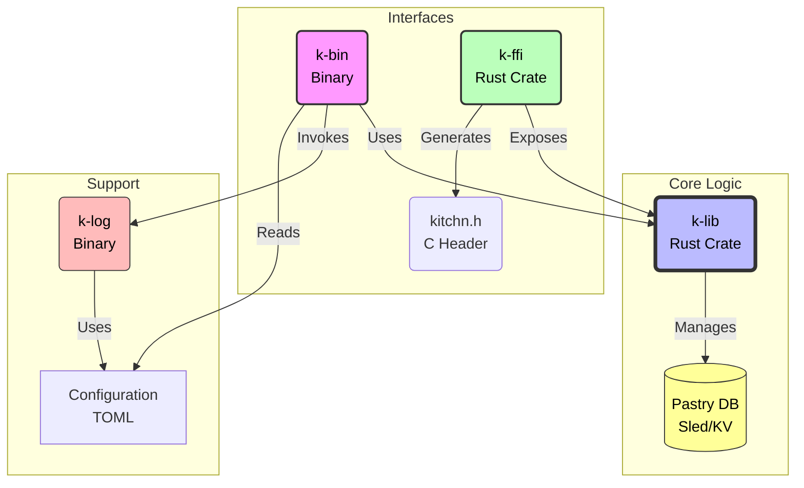

# Kitchn


**Strict Corporate Design Enforcement for your System.**

> "Single Source of Truth". One config change propagates to Shells, Scripts, Logs, GUIs, and TUI apps instantly.
> Now with C-API support for C++, Python, and more.

<p align="center">
  
  
  
  
  
</p>

---

##  Mission

Kitchn unifies the theming and configuration of your entire ecosystem (e.g., Hyprland, Waybar, Alacritty). Instead of editing 10 different config files to change a color or font, you edit **one** central configuration. Kitchn then propagates these changes to all your installed applications ("Ingredients") via powerful templates.

With the new **C-ABI Compatible Core**, Kitchn is no longer just a CLI tool—it's a system-wide SDK that can be embedded into any application.

##  Installation

### Option A: One-liner (Recommended)
```bash
curl -fsSL https://raw.githubusercontent.com/ryugen-io/kitchN/master/install.sh | bash
```

### Option B: Specific Version
```bash
curl -fsSL https://raw.githubusercontent.com/ryugen-io/kitchN/master/install.sh | bash -s -- v0.2.0
```

### Option C: From Source
```bash
git clone https://github.com/ryugen-io/kitchN.git
cd kitchn
just install
```

### Option D: Manual Download
Download the latest release from the [Releases page](https://github.com/ryugen-io/kitchN/releases), extract and run:
```bash
tar xzf kitchn-v*.tar.gz
cd kitchn-v*/
./install.sh
```

All methods will:
1.  Create `~/.config/kitchn/` with default configurations.
2.  Install binaries (`kitchn`, `kitchn-log`) to `~/.local/bin/`.
3.  Install FFI library (`libkitchn_ffi.so`) to `~/.local/lib/kitchn/`.

> [!IMPORTANT]
> Ensure `~/.local/bin` is in your `$PATH`.

---

##  Quick Start

Get up and running in 3 steps:

```bash
# 1. Install Kitchn
curl -fsSL https://raw.githubusercontent.com/ryugen-io/kitchN/master/install.sh | bash

# 2. Stock an example ingredient
kitchn stock ./assets/ingredients/waybar.ing

# 3. Apply all ingredients
kitchn cook
```

### Typical Workflow

1. **Edit your theme** in `~/.config/kitchn/theme.toml`
2. **Run** `kitchn cook` to apply changes
3. **Done!** All configured apps update automatically

### Creating Your Own Ingredient

```bash
# Create a new ingredient file
cat > my-app.ing << 'EOF'
[package]
name = "my-app-theme"
version = "0.1.0"

[[templates]]
target = "~/.config/my-app/colors.conf"
content = """
background = "{{ colors.bg }}"
foreground = "{{ colors.fg }}"
accent = "{{ colors.primary }}"
"""

[hooks]
reload = "pkill -USR1 my-app"
EOF

# Stock and cook
kitchn stock my-app.ing
kitchn cook
```

---

## Project Structure

```bash
.
├── crates/
├── crates/
│   ├── k-lib/           # Core Logic (Rust 2024)
│   ├── k-ffi/           # FFI Interface (Rust 2021, C-ABI)
│   ├── k-bin/           # CLI wrapper (`kitchn`)
│   └── k-log/           # Logging CLI (`kitchn-log`)
├── include/             # Generated C headers (kitchn.h)
├── assets/
│   ├── ingredients/     # Example .ing files
│   ├── examples/        # C++, Python, Rust integration examples
├── Cargo.toml           # Workspace config
└── justfile             # Command runner
```

###  Core Architecture


-   **Logic**: `k-lib` (Rust 2024) handles all processing, rendering, and logic.
-   **Interface**: `k-ffi` (Rust 2021) provides a stable C-ABI and auto-generates `kitchn.h` using `cbindgen`.
-   **Storage**: Ingredients are ingested into a high-performance **binary database** (`pastry.bin`) located in `~/.local/share/kitchn/`, ensuring instant access and clean storage.

###  The "Sweet Dracula" Standard

Kitchn enforces a strict, vibrant Dracula palette across your system:

| Color | Hex | Role | Usage |
|-------|-----|------|-------|
|  **Background** | `#282a36` | Canvas | Windows, Terminals, Editors |
|  **Current** | `#44475a` | Selection | Active lines, Hover states |
|  **Foreground** | `#f8f8f2` | Text | Main content text |
|  **Purple** | `#bd93f9` | Primary | Accents, Borders, Keywords |
|  **Pink** | `#ff79c6` | Secondary | Highlights, Strings, Urgent |
|  **Green** | `#50fa7b` | Success | Validations, ok, diff(+)|
|  **Red** | `#ff5555` | Error | Failures, deletions, diff(-) |
|  **Orange** | `#ffb86c` | Warning | Constants, Escapes, Notes |
|  **Cyan** | `#8be9fd` | Info | Metadata, Types, Links |

---

##  Integration & FFI

`kitchn_lib` exposes a **C-ABI** compatible interface, allowing you to use Kitchn's configuration, logging, and packaging logic in other languages.

### C / C++
Include the header and link against the library:
```cpp
#include "kitchn.h"

KitchnContext* ctx = kitchn_context_new();
kitchn_context_set_app_name(ctx, "MyApp");
kitchn_log_preset(ctx, "boot_ok", NULL);
kitchn_context_free(ctx);
```

### Python
Use `ctypes` to load the shared library:
```python
import ctypes
lib = ctypes.CDLL("libkitchn_ffi.so")
ctx = lib.kitchn_context_new()
```

### Examples
Run the built-in examples to see it in action:
```bash
just examples
# OR specific ones:
just example-cpp
just example-python
just example-rust
```

---

## Commands

### Ingredient Management
```bash
# Install a single ingredient or .bag package
kitchn stock ./assets/ingredients/waybar.ing
kitchn stock ./my-theme.bag

# List all stocked ingredients
kitchn pantry

# Cook (apply) all ingredients to the system
kitchn cook

# Clean (remove) all ingredients from pantry
kitchn pantry clean

# Enable/Disable ingredients
kitchn pantry disable waybar-theme
kitchn pantry enable waybar-theme
```

### Packaging
```bash
# Wrap multiple .ing files into a portable .bag package
kitchn wrap ./my-ingredients/

# Specify custom output path
kitchn wrap ./my-ingredients/ --output ./my-theme.bag
```

### Performance Optimization
```bash
# Pre-compile config files into binary format for faster startup
kitchn bake
```

> [!TIP]
> Run `kitchn bake` after changing your configuration files (`theme.toml`, `icons.toml`, etc.) to cache them for instant loading.

### Logging
```bash
# Ad-hoc logging
kitchn-log error SYSTEM "Database connection failed"

# Using a preset
kitchn-log boot_ok
```

#### App-Scoped Logging
You can configure Kitchn to organize logs by application name in `layout.toml`:
```toml
path_structure = "{year}/{month}/{app}/{scope}"
app_name = "kitchn" # Default app name
```

Override the app name via CLI:
```bash
kitchn-log boot_ok --app MyApp
```

---

##  Debugging

Kitchn includes a powerful debug mode to diagnose failing hooks or configuration issues.

```bash
kitchn --debug
```

This will spawn a **separate terminal window** (prioritizing `rio`, `alacritty`, `kitty`) that streams verbose logs, including:
- Exact commands executed by hooks
- Stdout/Stderr from hooks (even if empty)
- Configuration files loaded
- Tera template context keys

You can also attach it to specific commands:
```bash
kitchn cook --debug
kitchn bake --debug
```

---

##  Robustness

Kitchn enforces a **Single Instance Policy** using OS-level file locking (`flock`). This ensures that only one instance manages the pantry or system configuration at a time, preventing database corruption and conflicts.

-   **Automatic Cleanup**: If Kitchn crashes, the kernel releases the lock immediately.
-   **Non-Blocking**: A second instance will fail immediately with a clear error message instead of hanging.
-   **Debug Exception**: The debug viewer (`kitchn --debug`) is exempt and can run in parallel.

---

##  Ingredients (`.ing`)

An **Ingredient** is a single TOML file that teaches Kitchn how to theme a specific application. Ingredients are **ingested** into the `PastryDB` upon installation, meaning you don't need to keep the original files.

### Structure
```toml
[package]
name = "waybar-theme"
version = "0.1.0"
authors = ["Your Name <you@example.com>"]
description = "Waybar styling integration"
license = "MIT"

[[templates]]
target = "~/.config/waybar/style.css"
content = """
* {
    font-family: "{{ fonts.ui }}";
    font-size: {{ fonts.size_ui }}px;
}
window#waybar {
    background-color: {{ colors.bg }};
    border-bottom: 2px solid {{ colors.primary }};
}
"""

[hooks]
reload = "pkill -SIGUSR2 waybar"
```

### Package Fields

| Field | Required | Description |
|-------|----------|-------------|
| `name` | Yes | Unique identifier for the ingredient |
| `version` | Yes | Semantic version (e.g., `0.1.0`) |
| `authors` | No | List of author names and emails |
| `description` | No | Short description of what this ingredient themes |
| `license` | No | License identifier (e.g., `MIT`, `GPL-3.0`) |
| `ignored` | No | Set to `true` to disable without deleting (Default: `false`) |

---

##  Bags (`.bag`)

A **Bag** is a portable zip archive containing multiple `.ing` files. Use bags to distribute complete theme collections.

### Creating a Bag
```bash
# Package all .ing files from a directory
kitchn wrap ./my-theme-ingredients/

# Creates: my-theme-ingredients.bag
```

### Installing a Bag
```bash
# Extract and stock all ingredients from a bag
kitchn stock ./my-theme.bag
```

> [!NOTE]
> Bags are simply ZIP files with a `.bag` extension. You can inspect their contents with any archive tool.

---

##  Template Variables

Ingredients use the [Tera](https://keats.github.io/tera/) templating engine. The following variables are available:

### Colors (`colors.*`)
All colors defined in `theme.toml`:
```
{{ colors.bg }}         → #161925
{{ colors.fg }}         → #F8F8F2
{{ colors.primary }}    → #BD93F9
{{ colors.secondary }}  → #FF79C6
{{ colors.success }}    → #50FA7B
{{ colors.error }}      → #FF5555
{{ colors.warn }}       → #FFB86C
{{ colors.info }}       → #8BE9FD
```

### Fonts (`fonts.*`)
```
{{ fonts.mono }}        → JetBrainsMono Nerd Font
{{ fonts.ui }}          → Roboto
{{ fonts.size_mono }}   → 10
{{ fonts.size_ui }}     → 11
```

### Icons (`icons.*`)
Icons from the active icon set (configured via `theme.toml`):
```
{{ icons.success }}     →  (or * in ASCII mode)
{{ icons.error }}       →  (or ! in ASCII mode)
{{ icons.warn }}        →
{{ icons.info }}        →
{{ icons.net }}         → 󰖩
```

### Tera Filters
Kitchn provides custom filters for common transformations:

| Filter | Input | Output | Use Case |
|--------|-------|--------|----------|
| `hex_to_rgb` | `#BD93F9` | `[189, 147, 249]` | JSON/Chrome themes |

**Example:**
```toml
content = """
{
  "colors": {
    "toolbar": {{ colors.bg | hex_to_rgb }}
  }
}
"""
```

---

##  Configuration

Located in `~/.config/kitchn/`.

| File | Purpose |
|------|---------|
| `theme.toml` | Colors, fonts, and visual settings |
| `icons.toml` | Icon sets (Nerd Font, ASCII fallback) |
| `layout.toml` | Log message structure and formatting |
| `dictionary.toml` | Pre-defined log message presets |

You may split your configuration using `include = ["path/to/extra.toml"]`.

### theme.toml
```toml
[meta]
name = "Sweet Dracula"

[settings]
active_icons = "nerdfont"  # or "ascii"

[colors]
bg = "#161925"
fg = "#F8F8F2"
primary = "#BD93F9"
# ... see full palette above

[fonts]
mono = "JetBrainsMono Nerd Font"
ui = "Roboto"
size_mono = "10"
size_ui = "11"
```

### icons.toml
```toml
[nerdfont]
success = ""
error = ""
warn = ""
info = ""

[ascii]
success = "*"
error = "!"
warn = "!!"
info = "i"
```

### layout.toml
```toml
[tag]
prefix = "["
suffix = "]"
transform = "lowercase"

[labels]
error = "error"
success = "success"

[structure]
terminal = "{tag} {scope} {icon} {msg}"
file = "{timestamp} {tag} {msg}"

[logging]
base_dir = "~/.local/state/hyprcore/logs"
path_structure = "{year}/{month}/{scope}"
```

### dictionary.toml
Define reusable log presets:
```toml
[presets.boot_ok]
level = "success"
scope = "SYSTEM"
msg = "startup complete"

[presets.deploy_fail]
level = "error"
scope = "DEPLOY"
msg = "deployment failed"
```

Use presets via CLI:
```bash
kitchn-log boot_ok
kitchn-log deploy_fail
```

### Rich Text in Messages
Log messages support inline formatting tags:
```toml
msg = "Welcome to <primary>Kitchn</primary>! Status: <success>OK</success>"
```

| Tag | Effect |
|-----|--------|
| `<bold>` | Bold text |
| `<primary>` | Primary color (purple) |
| `<secondary>` | Secondary color (pink) |
| `<success>` | Success color (green) |
| `<error>` | Error color (red) |
| `<warn>` | Warning color (orange) |
| `<info>` | Info color (cyan) |

---

##  Uninstall

```bash
just uninstall
```
